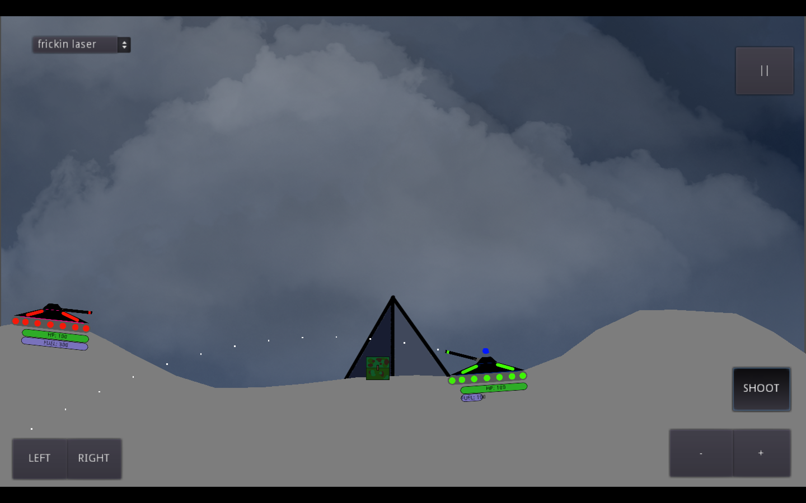
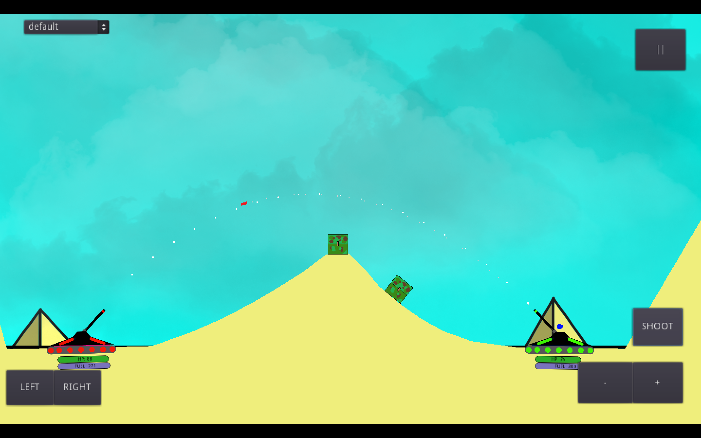

# Tanks: a Romulans Production 
> Team comprised of Alexander Wilems, Nat Arney, Benjamin Marble, Adrian Lamphier

> This program is meant to be a local multiplayer 2D strategy and turn based tank arcade game. 
Our audience is ourselves and anyone else who may find this game fun.
 
> We want to make this game to get a better feel for the design side of programming, and learning 2D game creation seems like something fun to learn for the group. we chose to do this over working on something more pragmatic, as the goal of this class is not to create something that will change the world, but learn tools such as Jira, Bitbucket, and learning how to communicate as a team. we also felt that the creation of just a code based program would not give us the challenge of communication in a way that a multimedia program such as a game would. 

## Table of contents
* [General info](#general-info)
* [Screenshots](#screenshots)
* [Technologies](#technologies)
* [Setup](#setup)
* [Features](#features)
* [Status](#status)
* [Review](#review)
* [Moving Forward](#moving-forward)
* [Inspiration](#inspiration)
* [Contact](#contact)

## General info
This videogame is a 2D sandbox shooter with a sci-fi theme. Multiple players can manipulate a sci-fi tank and launch projectiles in a turn based competition.

## Screenshots
More to come!

## Technologies
* Tech 1 - version 1.0 (c++ as base language), Github, Sourcetree, Godot. 
* Tech 2 - version 2.0 (no change to used technology)
* Tech 3 - version 3.0 (no change to used technology)

## Setup
* click [here]() to play, or go to 

## Features
* Movement of tanks
* Firing of multiple types of projectiles including, but not limited to, Bullets, Bombs, and Sharks with frickin lasers! (Minus the Sharks)
* Local multiplayer capabilities
* Ability to pause and exit
* Fuel has been implemented! Make sure to carpool!

More is on its way! Stay tuned!

## Status
Project is: _in progress
Sprint 1: Completed
Sprint 2: Completed
Sprint 3: Completed
Post sprint 3: more on its way! stay tuned!

## Review

### Alexander Wilems
Sprint 3

Creation of Particle effects for lasers, assets for new weapons, bullet line basic set up and implementation. Focus on quality of life animations. Change of version number to indicate end of semester based development. 

* Accomplishment: Creation of animated health and fuel bars utilizing the same script template, allowing for reuse of code without copy, and giving the user a visual representation of what their health/fuel level is without trying to see a number that may be hard for those with accessibility needs to read without extra support. 
Link to git repository [here](https://bitbucket.org/cs3398s21romulans/romulans-tank-game-repository/src/master/Game/Script/HitPoints.gd)

sprint 2

Creation of most animations, modifications of tanks to be symmetrical. Development of rudimentary points system, upscaling of map resolutions.

* Accomplishment: Modification of symmetrical tanks allowing for less awkward player controls. Link to git repository [here](https://bitbucket.org/cs3398s21romulans/romulans-tank-game-repository/src/master/Game/images/Tanks/symTankGreen.png)

sprint 1

Creating art and main menu for game. Backgrounds have been created, but not implemented yet. 

* Accomplishment: Creation of fully functioning Title Screen. creates a starting page for game, ability to exit if program was opened accidentally, and allows start of game. Link to git repository for Main Menu [here](https://bitbucket.org/cs3398s21romulans/romulans-tank-game-repository/src/master/Game/scenes/TitleScreen.tscn).

### Nat Arney 
Sprint 3

* Accomplishment: Created and implemented powerups/items to allow for more dynamic gameplay. Link to git repository [here](https://bitbucket.org/cs3398s21romulans/romulans-tank-game-repository/src/master/Game/Script/Powerups.gd).

Sprint 2

Level cycling, endgame, fuel system, and tank interactions.

* Accomplishment: Created and implemented the level cycling in the Tank Game. When one level ends, the game cycles to the next in line (Level 1 to Level 2, 3, 4...) until there are no more levels to cycle through, at which point the game ends. [Link to code](https://bitbucket.org/cs3398s21romulans/romulans-tank-game-repository/src/master/Game/Script/World.gd).

Sprint 1

Creation of basic terrain hit-boxes, health functions of tanks, and damage functions for the game, and in game pause menu. Most functions created are currently implemented in game. 

* Accomplishment: Creation of health and damage mechanics for the tanks and projectiles. Creation of these allows for there to be a goal that can be accomplished in the game of dispatching your opponent with the use of projectiles, and allows the game to have somewhat of an ending. Repository link to code can be found [here](https://bitbucket.org/cs3398s21romulans/romulans-tank-game-repository/src/master/Game/Script/TankRigid.gd). *(Please note, while health can run out in game, and player is dusted once dead, there is not yet an end of game mechanic for when only 1 player is left standing, to be added in next sprint.)*

### Benjamin Marble 
Sprint 3

Implementation of a music changer that advances the level music to the next track when switching to the next level. Creation of a credits screen. Creation of sound effects for additional weapons and menu buttons, as well as additional music tracks. Cleaned some clutter in the repository.

* Accomplishment: Implementation of the credits screen. Created a new "credits" scene and linked it to a new "credits" button that is now found on the title screen. Utilized borrowed code(credited below) to soup-it-up and give it features such as holding the down arrow key to fast-forward and hitting escape to return to the title screen. Heavy edits were made to help with spacing and music synchronization, the music track finishes as the credits naturally scroll to the end. Created music for credits was re-assigned as a level track due to a shorter run time, resulting in all Rocky level music (pun intended) and Adrian's groovy tracks being featured in the credits and title screens. Links to [CreditsScript](https://bitbucket.org/cs3398s21romulans/romulans-tank-game-repository/src/master/Game/Script/Credits.gd), [CreditsButton](https://bitbucket.org/cs3398s21romulans/romulans-tank-game-repository/src/master/Game/Script/CreditsButton.gd), and [CreditsScene.](https://bitbucket.org/cs3398s21romulans/romulans-tank-game-repository/src/master/Game/scenes/Credits.tscn)

sprint 2

Sounds for new weapons, weapon projectile/sub-projectile explosions, tank movement, and turret movement have been created and implemented into the game.

* Accomplishment: Implementation of unique sound effects for each tank weapon projectile and projectile explosion. Any weapon projectile that contacts a solid object will trigger the projectile's corresponding explosion sound effect. This makes the game feel more realistic since rounds now make a satisfying concussion upon impact. The cluster cannon shows off this feature, as it has additional explosions! [Repository audio](https://bitbucket.org/cs3398s21romulans/romulans-tank-game-repository/src/master/Game/audio/) [Script for cluster explosions](Game/Script/clusterExplosion.gd) [Script for initial cluster impact "pop"](Game/Script/cluster.gd)

sprint 1

Creation and implementation of music and sound effects. Menu and level music, as well as basic sound effects for explosions have been implemented into the game, as of Sprint 1.

* Accomplishment: Implementation of the sound effects for the tank weapon and for when a player takes damage. When a projectile is fired, the sound effect for the tank turret immediately plays. The explosive sound is supposed to give the player a sense of power when firing the tank turret, boosting immersion and enjoyment of the game. Repository link to main gun firing sound effect [here](https://bitbucket.org/cs3398s21romulans/romulans-tank-game-repository/src/master/Game/Script/PlayerController.gd). *(Please note this file has been worked on by multiple members for implementation of items only in the scope of support for that member.)*

### Adrian Lamphier
Sprint 3

* Accomplishment:
Link to git repository [here]()

sprint 2

Added a [function](https://bitbucket.org/cs3398s21romulans/romulans-tank-game-repository/src/master/Game/Script/TankRigid.gd) to keep track of which weapon is being used.
Added two new [weapon types.](https://bitbucket.org/cs3398s21romulans/romulans-tank-game-repository/src/master/Game/Script/Gun.gd)

* Accomplishment: Implementation of randomized bomb direction and momentum for the cluster cannon weapon. This prevents the possibility of the same cluster bomb spread pattern from repeating over and over, boosting realism and player immersion.

sprint 1

Creating action groups such as shooting and movement for vehicles in-game. Also worked on slope movements, a mechanic currently not being implemented in demo of product. 

* Accomplishment: Implementation of projectile motion physics being applied to collidable bodies. The creation of this allows for a more realistic engagement during game-play, as we will see the projectile simulating the affects of gravity. Link to this can be found [here](https://bitbucket.org/cs3398s21romulans/romulans-tank-game-repository/src/master/Game/Script/bullet.gd)
.
*(Please note, not all game-play mechanics in picture are implemented as of completion of first sprint.)*

## Moving Forward
Due to the end of the semester, there no school sanctioned goal on moving forward. we as a group do hope to continue this project as a group if possible, or work on another project together for use of professional development. 

We hope for more to come, so stay tuned!

### Alexander Wilems
post sprint 3 

* edit bullet line to allow for better fit with weapon chosen (specifically the laser as this does not get effected by gravity)
* completion and implementation of solar beam.

sprint 2

* Renovation of bullet art.
* Addition of more Animations for quality of game-play.
* Animation of numbers for lost health.
* Increase resolution of tanks.
* Add Particle Affects to Frickin Lasers (they will be named that by end of last sprint).

sprint 1

* Creation of supplementary art for other team members such as backgrounds, projectiles, tanks, and other needed Assets.
* Update of current backgrounds and other assets for optimization and other such purposes.
* Creation of animations in reaction to in game actions.

### Nat Arney 

Sprint 2

* Refactoring.
* Bug squashing.
    * Audio bugs.
    * Visual (non-UI) bugs.
    * UI bugs.
* HP and Fuel representation updates.

Sprint 1

* Have levels end when only one tank remains on-screen.
* Swap to a different level when the previous one ends.
* Track "fuel"; disallow movement when fuel is 0.

### Benjamin Marble 
post sprint 3 

* Re-balance volume of music and sound effects
* Create options menu, starting with volume control
* Improve credits with background images and video
* Create dedicated sfx and music sound nodes to eliminate audio bugs
* Add music selection and shuffler to options menu
* Add unique sound effects for power-ups
* Create more level music

sprint 2

* Creation of a credits screen.
* Creation of unique music for desert level, night level, and credits screen.
* Program music functions for in-game pause menu, main menu and credits screen.
* Create and program SFX for any additional new weapons.
* Program SFX for all menu button interactions.
* Balance weapons/health/damage values.

sprint 1

* Creation of general SFX for new items.
* Creation of unique background music for each new level.
* Creation of weapons SFX for new weapons.
* Creation of a "kill-floor", an off-screen floor that sets a player's health to zero for when they fall off the map.

### Adrian Lamphier
sprint 2

* Possibly add background music.
* Help with general polish of visual effects.
* Create more weapon types.

sprint 1

* Design the shooting function to swap to different weapon types.
* Possibly adjust scale of tanks/map to allow more interesting weapons/map design.
* Create more weapon types.

## Inspiration
Based on Tanks 2 from coolmathgames.com

## Contact
* Email: RomulansTP2021@gmail.com

* Twitter: @RomulansP

* Reddit: u/RomulansTP

* Template created by [@flynerdpl](https://www.flynerd.pl/)*

## Usage Credits
We are still working! Stay tuned!

[Game engine](https://godotengine.org)

[Sound effects](https://www.zapsplat.com)

[Functions in credits](https://github.com/benbishopnz/godot-credits)

