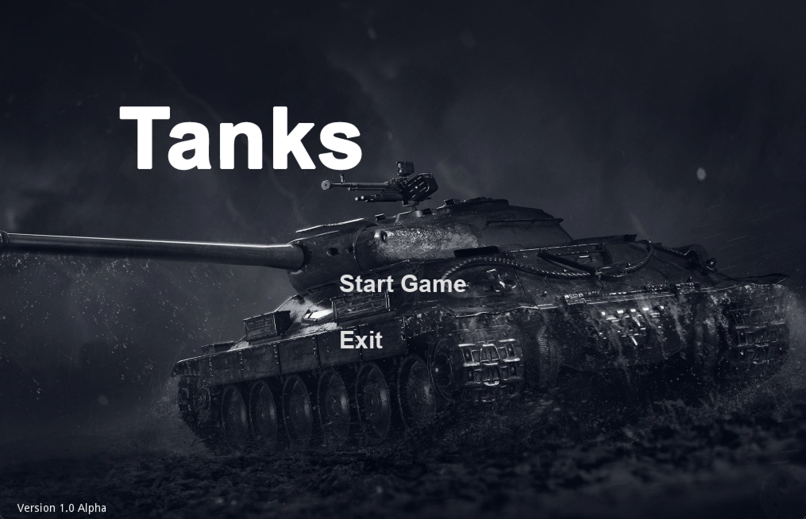
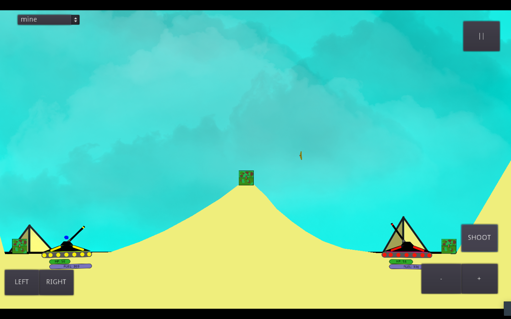
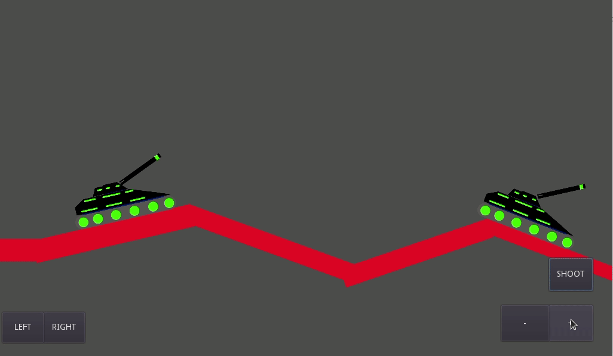

# Tanks: a Romulans Production 
> Team comprised of Alexander Wilems, Nat Arney, Benjamin Marble, Adrian Lamphier

> This program is meant to be a singleplayer 2D strategy and turn based tank arcade game. We hope to add a multiplayer mode after the 1st sprint.
Our audience is ourselves and anyone else who may find this game fun.
 
> We want to make this game to get a better feel for the design side of programming, and learning 2D game creation seems like something fun to learn for the group. We really have no goal for impact or change, just some fun. 

## Table of contents
* [General info](#general-info)
* [Screenshots](#screenshots)
* [Technologies](#technologies)
* [Setup](#setup)
* [Features](#features)
* [Status](#status)
* [Review](#review)
* [Moving Forward](#moving-forward)
* [Inspiration](#inspiration)
* [Contact](#contact)

## General info
This videogame is a 2D sandbox shooter with a sci-fi theme. Multiple players can manipulate a Sci-fi tank and launch projectiles in a turn based competition.

## Screenshots
More to come!

## Technologies
* Tech 1 - version 1.0 (c++ as base language), ,github, sourcetree, godot. 
* Tech 2 - version 2.0
* Tech 3 - version 3.0

## Setup
* Download executable for Mac or Windows [here](https://drive.google.com/drive/folders/1LyZBEC2Yr0cSZWqs52-E5R4sDup3EQeV?usp=sharing)
* If on mac, open Zip file, then run the executable. *(If given an error that the game cannot be run, cancel the notification, then go to system preferences > Security and Privacy. you will be prompted with a statement that it cannot be run because it isnt from an identified devloper. Click Open Anyway), then enjoy!
* If windows, double click the .pck file, then enjoy!

## Code Examples
More to come! Stay tuned!

## Features
* Basic Game movement
* Firing of projectiles and use of projectile motion
* Local multiplayer capabilities
* Ability to pause and exit

More is on its way! Stay tuned!

To-do list:
* Create an end game mechanic
* Increase map size
* Add new items

## Status
Project is: _in progress

## Review
As of Sprint 1 completion

### Alexander Wilems
Creating art and main menu for game. Backgrounds have been created, but not implemented yet. 

* Accomplishment: Creation of fully functioning Title Screen. creates a starting page for game, ability to exit if programm was opened accidentally, and allows start of game. Link to git repository for Main Menu [here](https://bitbucket.org/cs3398s21romulans/romulans-tank-game-repository/src/master/Game/scenes/TitleScreen.tscn).

### Nat Arney 
Creation of basic terrain hitboxes, health functions of tanks, and damage functions for the game, and in game pause menu. Most functions created are currently implemented in game. 

* Accomplishment: Creation of health and damage mechanics for the tanks and projectiles. Creation of these allows for there to be an accomplishable goal in the game of dispatching your oppenent with the use of projectiles, and allows the game to have somewhat of an ending. Repository link to code can be found [here](https://bitbucket.org/cs3398s21romulans/romulans-tank-game-repository/src/master/Game/Script/TankRigid.gd). *(Please note, while health can run out in game, and player is dusted once dead, there is not yet an end of game mechanic for when only 1 player is left standing, to be added in next sprint.)*

### Benjamin Marble 
Curation and implementation of music and sound effects. Menu and level music, as well as basic sound effects for explosions have been implemented into the game, as of Sprint 1.

* Accomplishment: Implementation of the sound effects for the tank weapon and for when a player takes damage. When a projectile is fired, the sound effect for the tank turret immediatly plays. The explosive sound is supposed to give the player a sense of power when firing the tank turret, boosting immersion and enjoyment of the game. Repository link to main gun firing sound effect [here](https://bitbucket.org/cs3398s21romulans/romulans-tank-game-repository/src/master/Game/Script/PlayerController.gd). *(Please note this file has been worked on by multiple members for implementation of items only in the scope of support for that member.)*

### Adrian Lamphier
Creating action groups such as shooting and movement for vehicles in-game. Also worked on slope movements, a mechanic currently not being implemented in demo of product. 

* Accomplishment: Implementation of projectile motion physics being applied to collidable bodies. The creation of this allows for a more realistic engament during gameplay, as we will see the projectile simulating the affects of gravity. Link to this can be found [here](https://bitbucket.org/cs3398s21romulans/romulans-tank-game-repository/src/master/Game/Script/bullet.gd)
.
*(Please note, not all gameplay mechanics in picture are implemented as of completion of first sprint.)*

## Moving Forward
### Alexander Wilems
* Creation of supplementary art for other team members such as backgrounds, projectiles, tanks, and other needed Assets.
* Update of current backgrounds and other assets for optimization and other such purposes.
* Creation of animations in reaction to in game actions

### Nat Arney 
* Have levels end when only one tank remains on-screen
* Swap to a different level when the previous one ends
* Track "fuel"; disallow movement when fuel is 0

### Benjamin Marble 
* Creation and curation of general SFX for new items
* Creation of unique background music for each new level
* Creation of weapons SFX for new weapons
* Creation of a "killfloor", an offscreen floor sets player health to zero for when they fall off the map

### Adrian Lamphier
* Design the shooting function to swap to different weapon types
* Possibly adjust scale of tanks/map to allow more interesting weapons/map design
* Create more weapon types

## Inspiration
Based on Tanks 2 from coolmathgames.com

## Contact
* Email: RomulansTP2021@gmail.com

* Twitter: @RomulansP

* Reddit: u/RomulansTP

*Template created by [@flynerdpl](https://www.flynerd.pl/)*

## Usage Credits
We are still working! Stay tuned!

[Game engine](https://godotengine.org)

[Sound effects](https://www.zapsplat.com)

